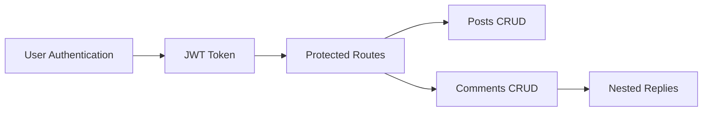

<!-- HEADER -->
<p align="center">
  
</p>

<h1 align="center">✨ Blog Management System ✨</h1>

<p align="center">
  
</p>

---

## 🚀 Project Overview

A scalable and secure backend system for a modern blogging platform built using **FastAPI**.  
The system provides structured content management with authentication, authorization, nested comments, and role-based access control.

---

## ✨ Features

💜 CRUD Operations for Posts and Comments  
💜 Nested Comments & Replies  
💜 Pagination Support  
💜 JWT Authentication  
💜 Role-Based Authorization  
💜 Ownership Access Control  
💜 Secure RESTful API  
💜 Clean Backend Architecture

---

## 👥 Roles

| Role | Permissions |
|------|-------------|
| 👑 Admin | Full moderation control |
| ✍️ Author | Create and manage own posts |
| 👀 Reader | View posts and comment |

---

## 🧩 Entities

```text
Users
Posts
Comments
````

---

## 🛠️ Tech Stack

<p align="center">


</p>

---

## ⚡ API Features



---

## 📂 Project Structure

```bash
blog-management-system/
│
├── routers/
├── models/
├── schemas/
├── database/
├── services/
├── auth/
├── tests/
└── main.py
```

---

## 👩‍💻 Team Members

✨ Doha Mohammed — Leader

✨ Aya Alaa

✨ Asmaa Mohamed

✨ Sara Mohamed

✨ Menna Sherif

✨ Ahmed Ashraf

---

## 🌸 Final Note

This project was developed as a backend practice project focusing on secure API development, clean architecture, authentication, authorization, and scalable blog management workflows 🚀

---

<p align="center">
  
</p>

